# RankTutor - Visual Flowchart (Mermaid Diagrams)

## 🏠 Application Entry Point

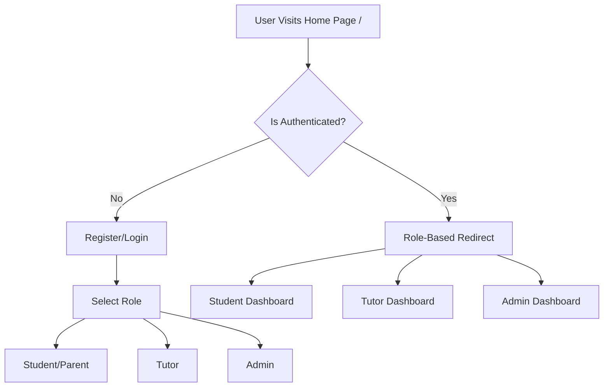

## 👨‍🎓 Student/Parent Flow

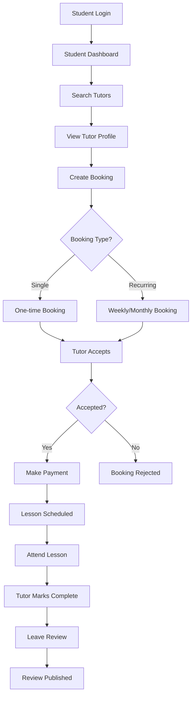

## 👨‍🏫 Tutor Flow

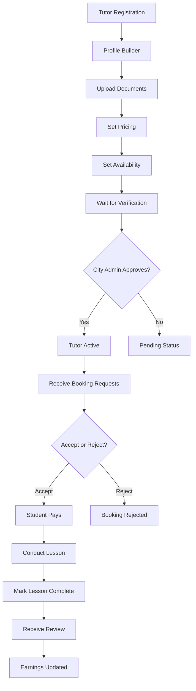

## 🏛️ City Admin Flow

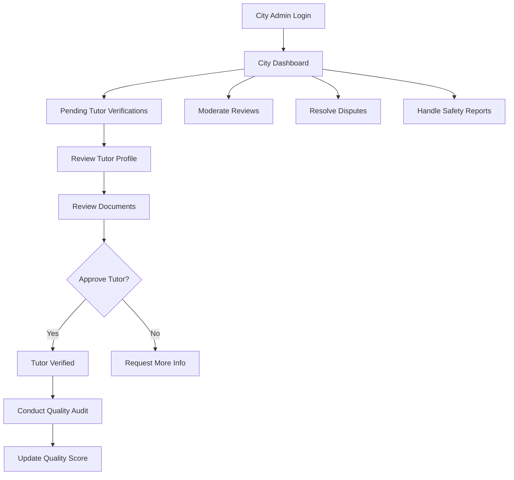

## 🌐 Global Admin Flow

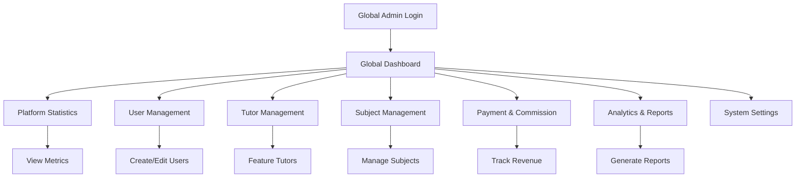

## 💳 Payment Flow

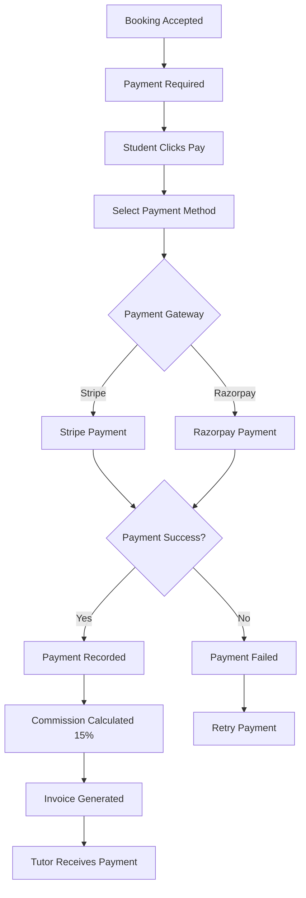

## 📋 Complete Booking Lifecycle

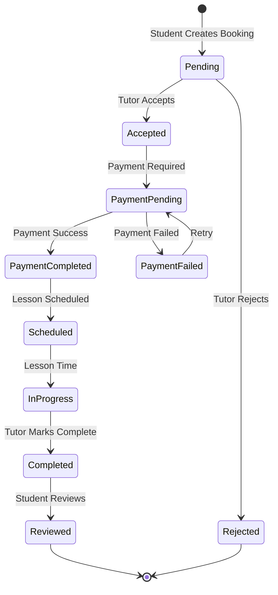

## 🔐 Authentication & Authorization

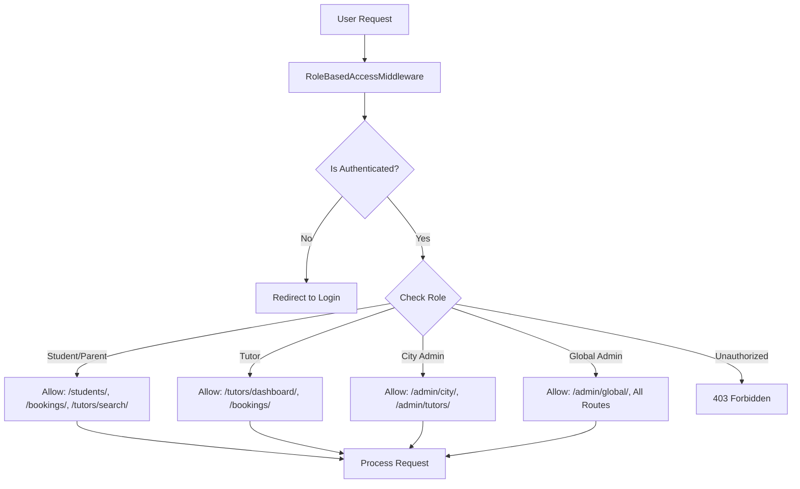

## 🏗️ System Architecture

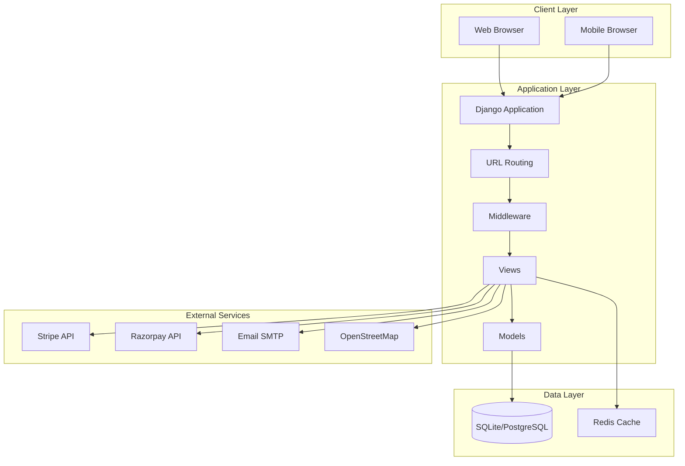

## 📊 Data Models Relationship

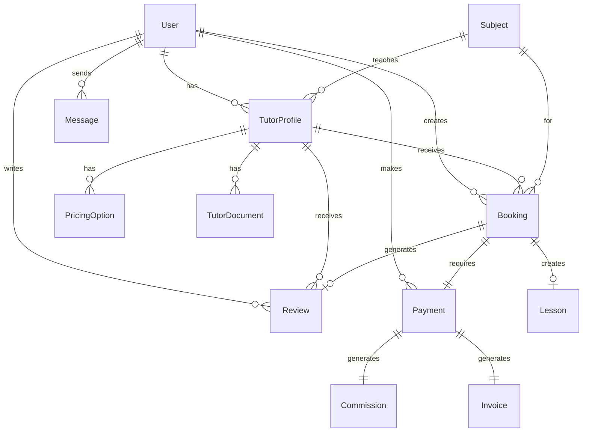

## 🔄 Recurring Booking Flow

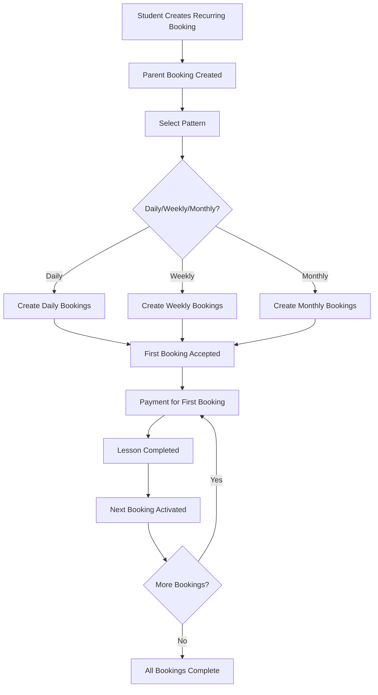

## 🎯 User Role Permissions Matrix

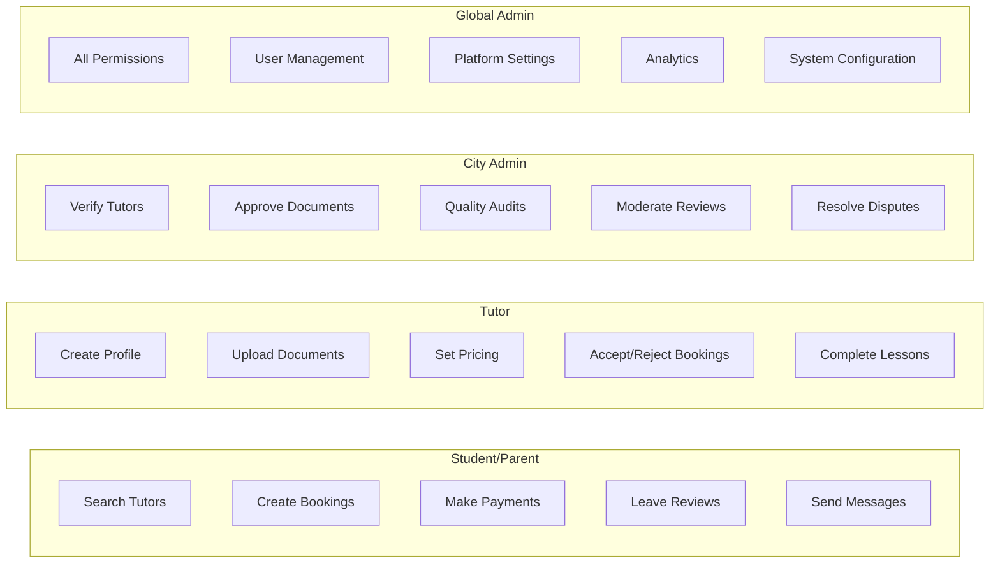

---

**Note**: These Mermaid diagrams can be rendered in:
- GitHub/GitLab markdown viewers
- VS Code with Mermaid extension
- Online Mermaid editors (mermaid.live)
- Documentation tools (MkDocs, Sphinx with extensions)

